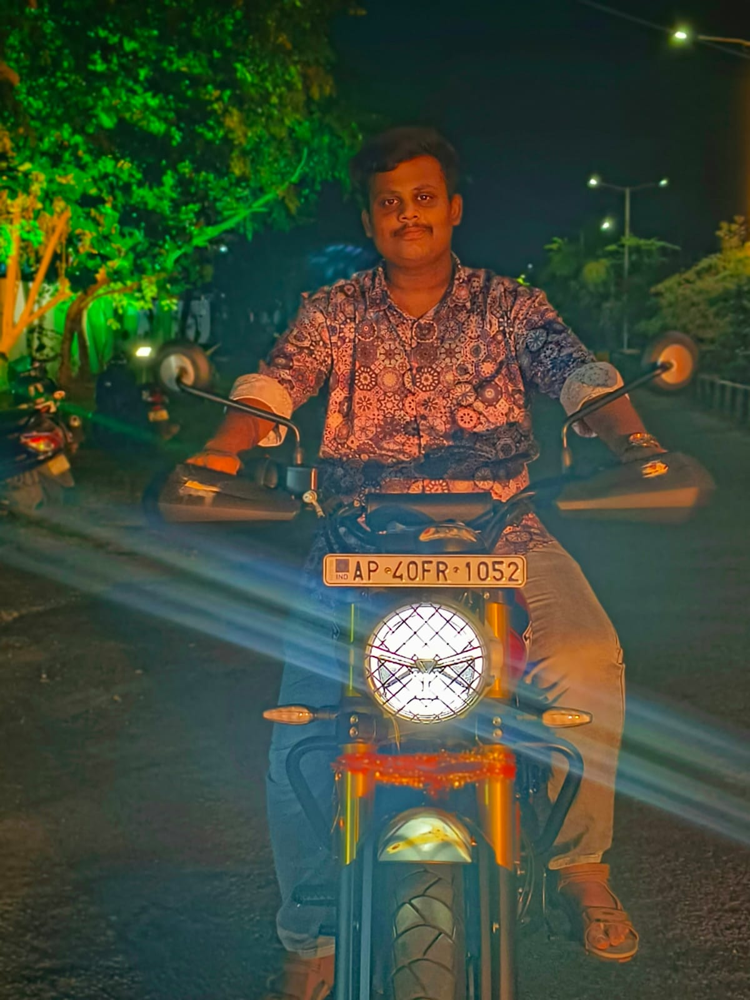

<!-- Rainbow Wave Header -->
<h1 align="center">
  
</h1>

<!-- Floating Profile Image -->

  

<!-- Animated Social Links -->
<h2 align="center">🔗 Connect with Me</h2>

  
  
  

<!-- Animated Divider -->

<!-- Glowing Tech Stack Section -->
<h2 align="center">🛠️ Tech Stack</h2>

  
  
  
  

<!-- GitHub Statistics -->
<h2 align="center">📈 GitHub Stats</h2>

  
  
  

<!-- Contact Section -->
<h2 align="center">📬 Contact Me</h2>

  

    <h3>📧 Email</h3>
    
ksmk2104@gmail.com

    <a href="mailto:ksmk21042gmail.com" style="color: #34F6D8; text-decoration: none;">Send Message →</a>
  

<!-- Visitor Counter -->

  

<!-- CSS Animations -->

